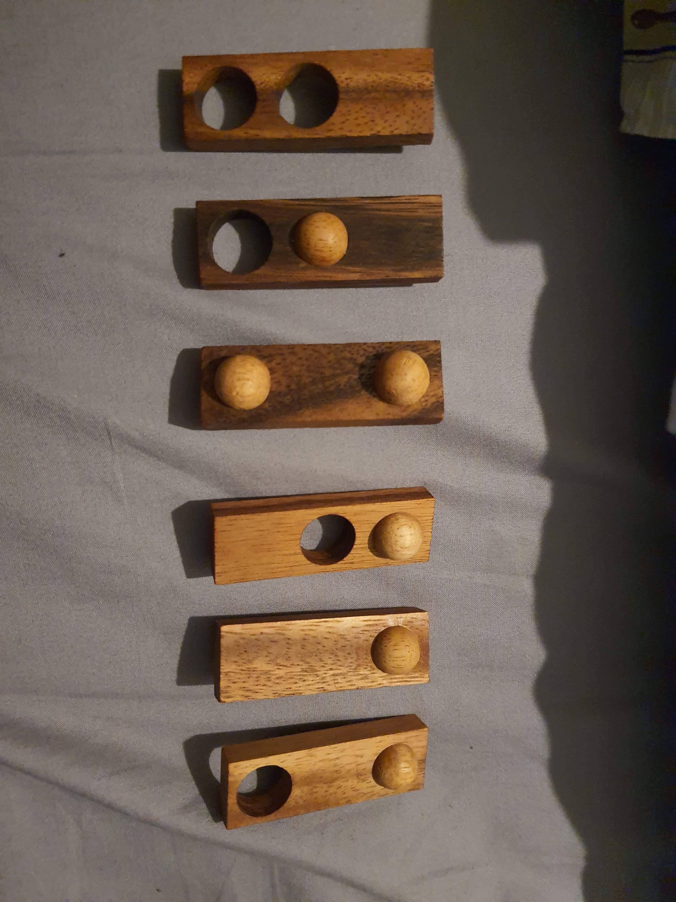
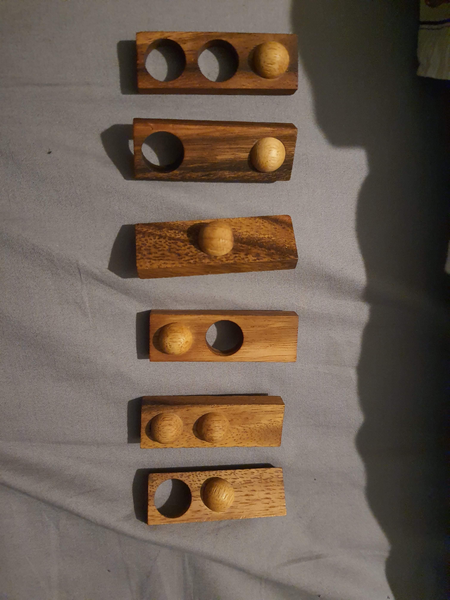
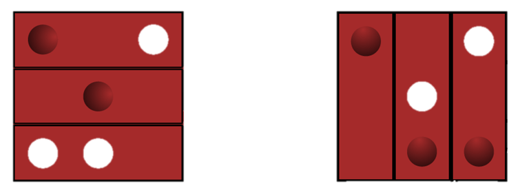

# casse-tete-solver

## What is a Casse-tête?

A "Casse-tête" is a french word for a puzzle or brainteaser, more literally translated as "head-breaker".

This project is a solver for a specific puzzle.

## The puzzle

The puzzle involves fitting together 6 blocks, each with 2 sides and 3 slots on each side which can have a hole, a bump, or a flat surface.

The blocks are as follows, the images showing both sides of the blocks:

The aim is to find a configuration of the blocks such that we can stack 3 of them on top of the other 3 and the inner surface mates properly. Below is an example of a valid solution, where the side on the right is the inner surface, ie its mirrored but both faces mate if closed like 2 sides of a book:

Note that since 3 blocks form a symmetrical 3x3 grid, the stacked pieces can be horizontally rotated relative to each other to fit.
